# 基于springboot的人格障碍诊断系统

<h4 style='color:red'>联系不到我，就看我的主页 </h4> 
 
#### 介绍

随着社会的发展和人们生活压力的增加，心理健康问题日益受到关注，人格障碍作为一种常见的心理障碍，其准确诊断对于患者的治疗和康复至关重要。然而，传统的诊断方式往往依赖于医生的主观判断和经验，缺乏标准化和客观性。
本基于 Spring Boot 的人格障碍诊断系统旨在提供一个科学、准确、高效的诊断平台，整合心理测试、数据分析和专业医生的评估，为患者提供更可靠的诊断结果，同时提高医疗机构的诊断效率和管理水平。

#### 技术栈

后端技术栈：Springboot+Mysql+Maven

前端技术栈：Vue+Html+Css+Javascript+ElementUI

开发工具：Idea+Vscode+Navicate

#### 系统功能介绍

（一）管理端  
个人中心：管理端人员可在个人中心查看和修改自己的个人信息，接收系统通知等。  
用户管理：对系统用户的信息进行管理，包括添加、删除、修改用户信息，以及设置用户权限等。  
医生管理：负责医生的信息登记、资质审核、工作安排和绩效评估等。  
公告信息管理：发布、编辑和删除系统的公告信息，确保用户及时了解系统的重要通知和动态。  
咨询信息管理：查看和处理用户的咨询信息，协调医生与用户之间的沟通。  
诊断记录管理：管理所有的诊断记录，包括查看、归档、统计分析等，为医疗研究和服务改进提供数据支持。  
测试模板管理：设计和维护用于诊断的心理测试模板，确保测试的科学性和有效性。  
试题管理：负责心理测试试题的录入、更新和分类管理，保证试题的质量和多样性。  
系统管理：对系统的参数设置、权限分配、数据备份与恢复等进行管理，保障系统的稳定运行。  
考试管理：安排和监督心理测试的进行，包括设置考试时间、考生名单、考试规则等。  

（二）医生端  
医生模块：展示医生的专业信息和擅长领域，方便用户选择。  
公告信息：查看系统发布的公告，了解最新的政策和通知。  
测试模板：使用管理端提供的测试模板对患者进行心理测试。    
个人中心：修改个人信息，查看自己的工作安排和诊断记录。  
后台管理  
公告信息管理：发布医生个人的公告，如出诊时间调整、学术讲座等。   
咨询信息管理：回复用户的咨询，提供初步的建议和指导。  
诊断记录管理：记录和管理自己为患者做出的诊断结果和治疗建议。  

（三）用户端  
医生模块：查找和了解医生的信息，选择适合自己的医生进行咨询和诊断。  
公告信息：获取系统和医生发布的公告，掌握相关动态。  
测试模板：按照要求完成心理测试，为诊断提供数据支持。  
个人中心：管理个人信息，查看自己的诊断历史和咨询记录。  
后台管理  
咨询信息管理：向医生发送咨询信息，描述自己的心理问题和需求。  
诊断记录管理：查看医生给出的诊断结果和治疗建议。  

#### 系统作用

提高诊断准确性  
借助标准化的测试模板和数据分析，减少主观因素的影响，提高诊断的准确性。  

优化医疗资源配置  
合理安排医生的工作，提高医疗资源的利用效率。  

增强患者参与度  
让患者通过用户端参与诊断过程，提高患者对自身心理健康的关注和治疗的依从性。

促进学术研究  
积累大量的诊断数据，为心理学和医学领域的研究提供宝贵的资源。  

#### 系统功能截图

代码结构

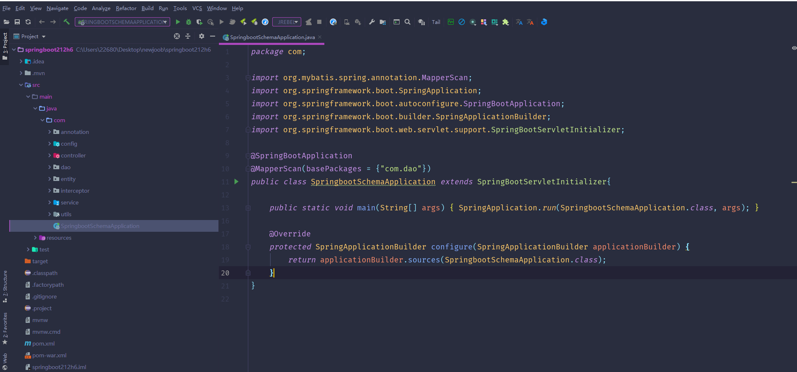

数据库表

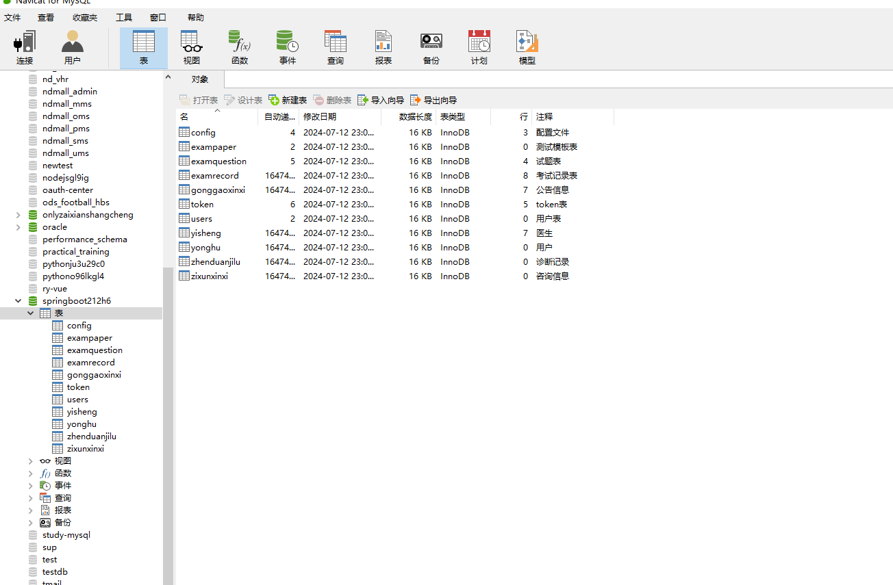

登录

前台页面首页

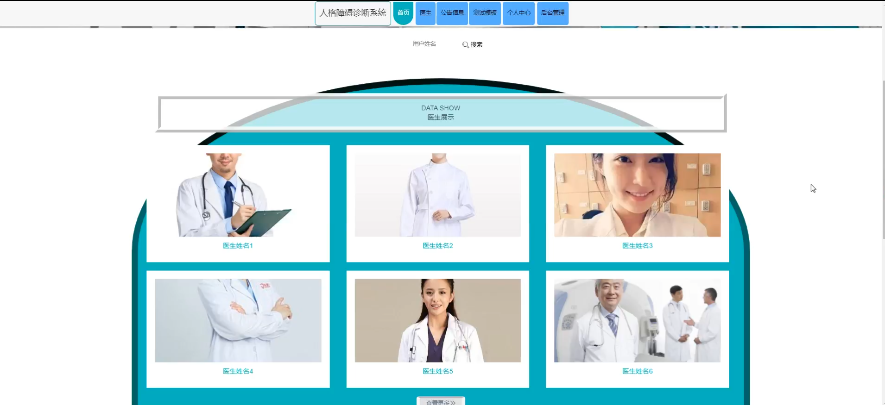

医生模块

个人中心

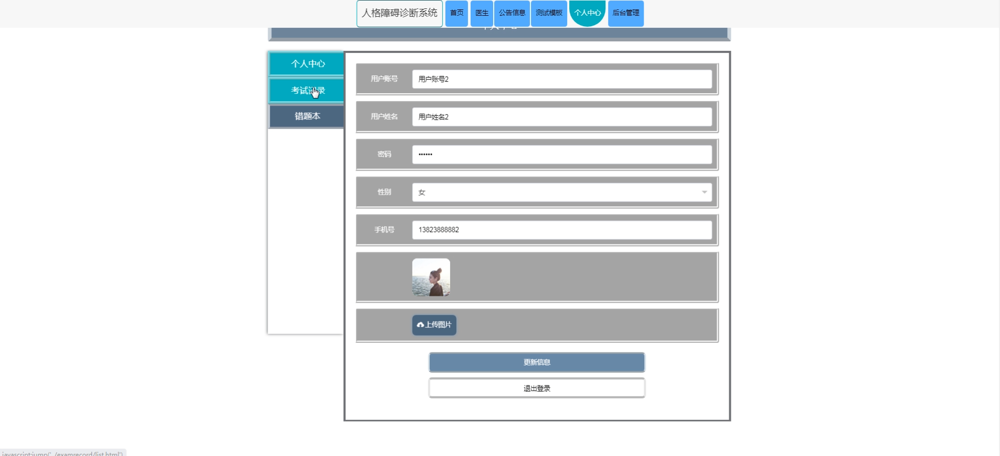

用户端后台管理

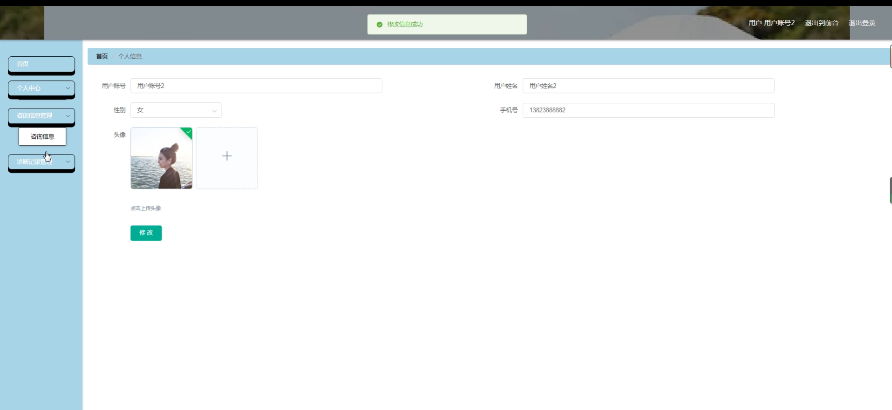

咨询信息管理

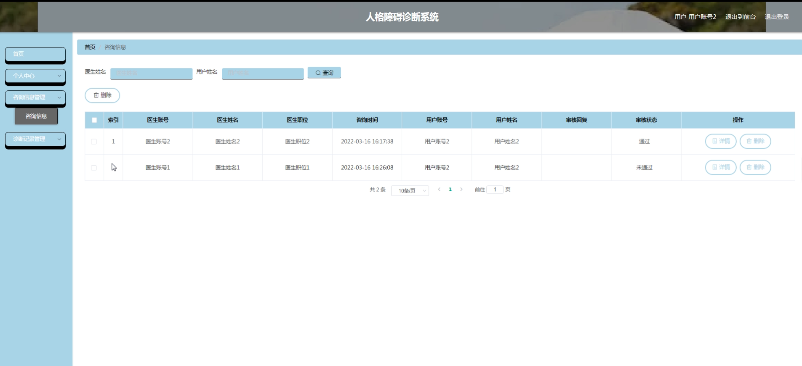

医生端公告信息管理

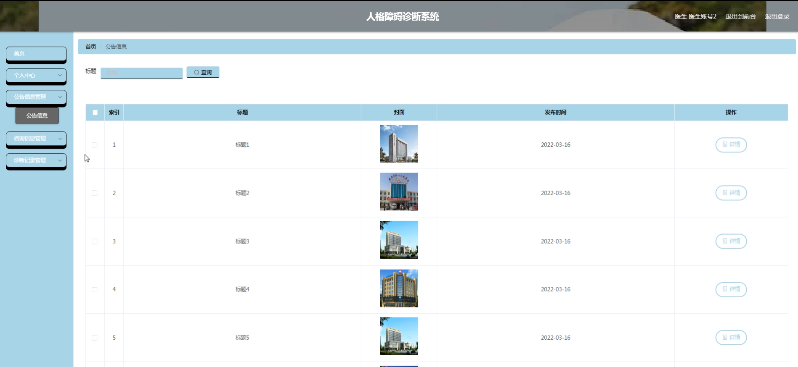

诊断记录管理

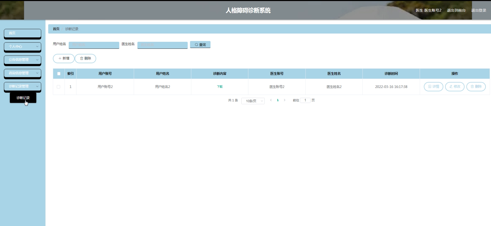

管理员端用户管理

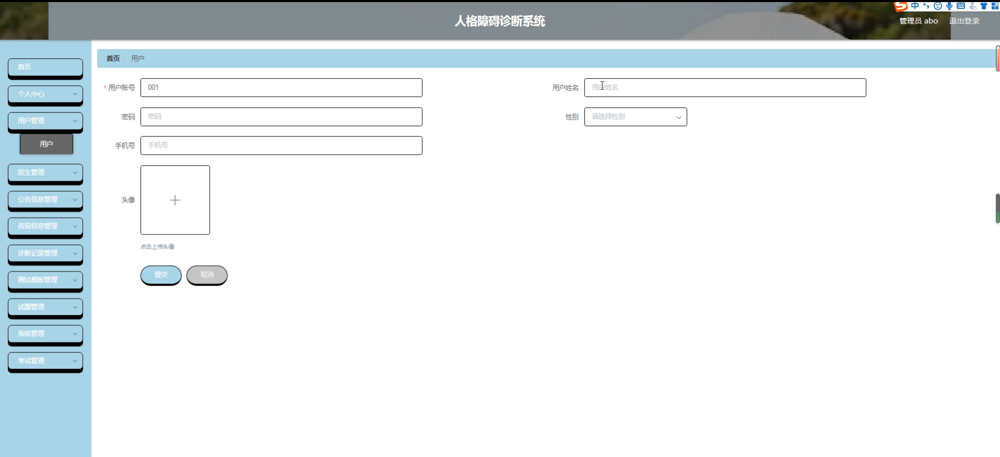

医生管理

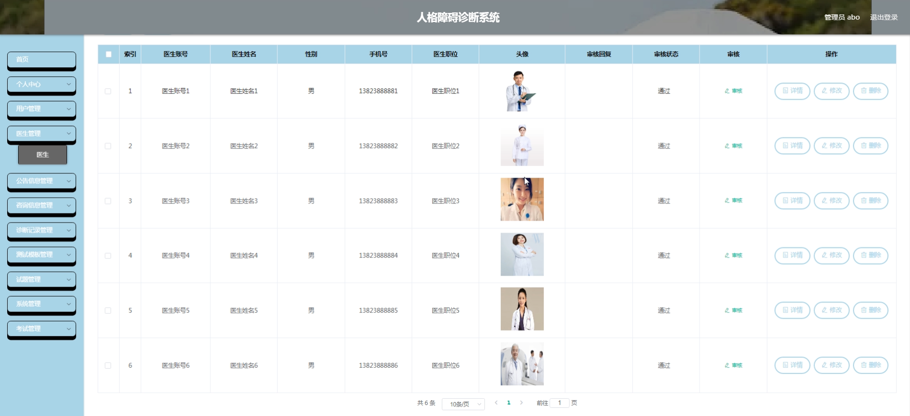

测试模板管理

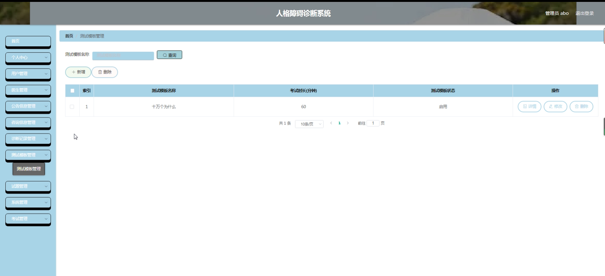

试题管理

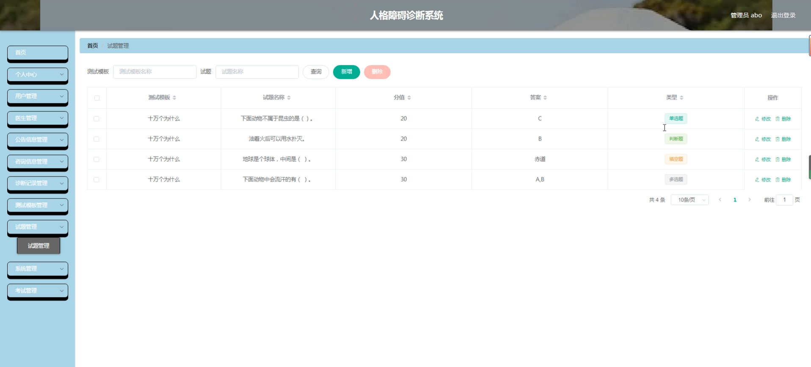

考试管理

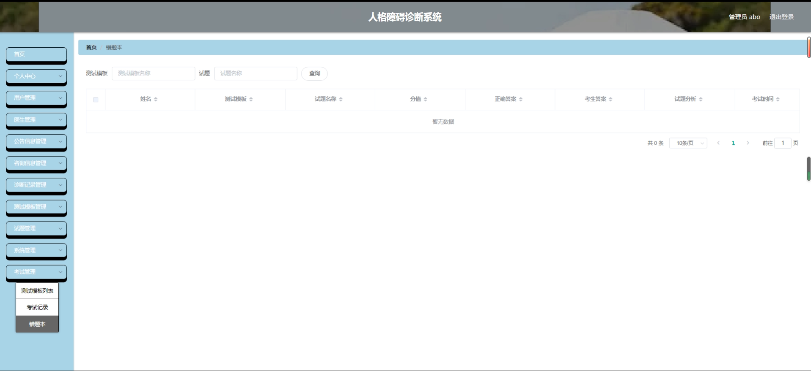

#### 总结

基于 Spring Boot 的人格障碍诊断系统为心理健康领域带来了新的工具和方法。然而，系统在实际应用中可能还存在一些不足之处，比如对于某些复杂或罕见的人格障碍类型的诊断准确性有待提高，系统的安全性和隐私保护需要进一步加强，与其他医疗信息系统的集成还不够完善等。未来，我们将持续改进和优化系统，加强与专业医疗机构和研究机构的合作，不断提升系统的性能和服务质量，为推动人格障碍诊断和治疗的发展做出更大的贡献。

#### 使用说明

创建数据库，执行数据库脚本 修改jdbc数据库连接参数 下载安装maven依赖jar 启动idea中的springboot项目

后台地址
http://localhost:8080/springboot212h6/admin/dist/index.html

管理员  abo 密码 abo

前台地址：http://localhost:8080/springboot212h6/front/index.html